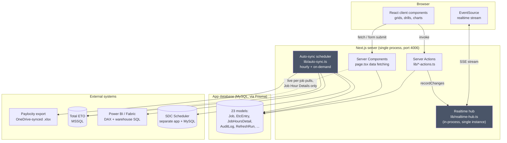

# Architecture

SDC Projects Reports ("ETC Planner") is an internal Next.js application that replaces a set of
manually-maintained Excel workbooks ("Managers Fill Out", "Standard Fees") with a shared,
live-editable web app. It tracks **Estimate-to-Complete (ETC)** hours and parts cost for every
active job, and re-implements several Power BI reports (Job Hours, BOM/Procurement) natively so
the business doesn't depend on a Power BI license or a working Fabric warehouse to see its own
numbers.

For where things live in the repo, see [CODEBASE-STRUCTURE.md](CODEBASE-STRUCTURE.md). For the
actual ETC formulas, see [ETC-BUSINESS-LOGIC.md](ETC-BUSINESS-LOGIC.md). This document covers
the shape of the system, not its business rules.

## System components

Three things about this diagram matter more than the boxes themselves:

1. **The realtime hub and the sync scheduler both live in the same Next.js process.** There is
   no separate worker, queue, or cache tier. `lib/realtime-hub.ts` is explicit that this only
   works because the app runs as one PM2 process with no clustering — see
   [REALTIME-SYNC.md](REALTIME-SYNC.md).
2. **Most of the app reads from the app's own MySQL database, not live from upstream systems.**
   Paylocity, Total ETO, and Power BI data is pulled on a schedule into the app's own tables
   (see [REFRESH-PIPELINE.md](REFRESH-PIPELINE.md)); the grids and dashboards read that copy.
   The one deliberate exception is the **Job Hour Details / Procurement** page, which queries
   Total ETO live, per job, on render (dashed line above) — because that data is per-job detail
   too large/volatile to pre-sync, not a general pattern.
3. **Power BI is legacy, not primary.** Hours now come from a Paylocity export file; parts cost
   comes from Total ETO directly. Power BI/Fabric is still called for section-code metadata on
   every refresh and for a CLI-only historical-backfill path, but nothing in the normal user
   flow depends on it being up. See [INTEGRATIONS.md](INTEGRATIONS.md).

## Next.js client/server boundaries

This is a standard App Router app, not a SPA with a JSON API behind it:

- **Route files** (`src/app/**/page.tsx`, `layout.tsx`) are Server Components. They call
  `prisma` and plain `lib/*.ts` functions directly to fetch data — there is no internal REST
  layer between a page and its data.
- **Mutations are Server Actions** in `src/lib/*-actions.ts` (14 files, all `"use server"`),
  imported directly into the client components that need them (autosave components, buttons).
  There's no separate API route for most writes — the `api/` route handlers exist only for
  things a Server Action can't do (SSE streams, server-to-server integration endpoints, an
  auth-exempt health check).
- **`"use client"`** marks ~96 files — almost everything interactive (grids, autosave,
  drill-throughs, charts). A page's Server Component renders the static shell and hands data
  down as props to these client islands.
- **`import "server-only"`** marks ~29 modules that touch a database or a secret directly but
  aren't Server Actions themselves (e.g. `scheduler-db.ts`, `realtime-hub.ts`, `job-bom.ts`) —
  a build-time guard against one of them ever being imported into client code by accident.

## Database layer

One Prisma-managed MySQL database (`DATABASE_URL`) is the app's own store — 23 models, migrated
incrementally (see [DEVELOPMENT.md](DEVELOPMENT.md) for the Prisma workflow). Two other
databases are reached directly, outside Prisma, and are **not** this app's data:

- **Total ETO** (MSSQL, via the `mssql` package) — the company's ERP. Read live for
  parts/BOM/PO data; never written to.
- **SDC Scheduler's MySQL** (via `mysql2`, read-only) — a sibling internal app's database, read
  to mirror its team roster.

## Authentication and authorization

NextAuth v5 (beta), JWT session strategy, **one provider: email/password credentials**
(bcrypt-hashed, checked against the `User` table). There is no active SSO — see
[INTEGRATIONS.md](INTEGRATIONS.md) for the important caveat that some existing docs and a
comment in the login page still describe a Microsoft Entra SSO setup that is not currently wired
into `lib/auth.ts`; that is stale documentation, not stale code, but worth knowing before
trusting those docs.

Authorization is intentionally flat: there is no role hierarchy gating features (a comment in
the audit-log page notes role gates were dropped app-wide on 2026-08-02 in favor of one shared
team password). The one remaining `role === "ADMIN"` check lets an admin manage any
department's ETC sign-off rather than only their own. Everything else sensitive (Submit, Reopen
Month, Sync History, the Standard Sheet, the Audit Log) is protected by a **shared "button
password"** (`lib/button-password.ts`) — explicitly documented as an "are you sure" step in
front of a destructive action, not an access-control boundary. The access-control boundary is
simply being signed in at all, enforced for every route by `src/proxy.ts`'s middleware (which
carves out `login`, `api/auth`, `api/integration/*`, `api/health`, and static assets).

## Realtime synchronization

A single in-process hub (`lib/realtime-hub.ts`) tracks presence (who's editing which cell) and
change events, pushed to browsers over Server-Sent Events. It only works because the app is a
single, non-clustered process — see [REALTIME-SYNC.md](REALTIME-SYNC.md) for the full event
model, conflict handling, and the explicit "this breaks if anyone adds a second instance"
warning from the code itself.

## Paylocity / OneDrive integration

Actual hours worked come from a payroll export workbook Lisa maintains, synced to this server
via OneDrive and read directly off disk (not a Graph/SharePoint API call). Import is
hash-identified (not filename/mtime), so re-syncing the same file is a no-op, and every rejected
row is classified and logged rather than silently dropped. See
[INTEGRATIONS.md](INTEGRATIONS.md) and [REFRESH-PIPELINE.md](REFRESH-PIPELINE.md).

## Total ETO integration

Parts cost, purchase orders, and the full BOM tree are queried live against Total ETO's SQL
Server. Most of that is pre-synced into the app's own tables on the refresh schedule; the one
live-per-request exception is the Job Hour Details / Procurement page, which is explicitly
time-boxed (a 12-second budget) after a real incident where an upstream slowdown held page
renders open for minutes. See [INTEGRATIONS.md](INTEGRATIONS.md).

## Refresh pipeline

One shared function (`lib/refresh-service.ts`'s `refreshAllData`) runs eight sync steps in a
fixed order, sequentially, with per-step failure isolation and no retry policy — run once at
server startup, once an hour on a timer, and on demand from the dashboard's "Refresh Data"
button. See [REFRESH-PIPELINE.md](REFRESH-PIPELINE.md).

## Main feature modules

| Route | Module | Core files |
|---|---|---|
| `/etc` | Monthly ETC grid — the "Managers Fill Out" sheet | `etc/page.tsx`, `lib/etc.ts`, `lib/etc-actions.ts`, `EtcStandardColumns.tsx` |
| `/job-hours` | Job Hour Details (hours dashboard + Parts Cost + Procurement) | `job-hours/page.tsx`, `lib/job-hours-dashboard.ts`, `lib/job-bom.ts`, `JobProcurement.tsx` |
| `/quoted` | Projects grid (quoted vs. actual) | `quoted/page.tsx`, `lib/quoted-actions.ts`, `lib/actual-hours.ts` |
| `/job-cost-explorer` | Password-gated per-job profit/margin (integrated from a separate standalone app) | `job-cost-explorer/page.tsx`, `lib/job-cost.ts`, `lib/job-cost-source.ts`, `JobCostExplorer.tsx` |
| `/employees` | Read-only roster (synced from Scheduler/Paylocity) | `employees/page.tsx`, `lib/sync-scheduler-team.ts` |
| `/audit-log` | Password-gated audit trail | `audit-log/page.tsx`, `lib/audit.ts` |

See [CODEBASE-STRUCTURE.md](CODEBASE-STRUCTURE.md) for the full file breakdown per module.

## Architectural decisions worth knowing

- **Server Actions, not a REST layer, for mutations.** Cuts out a whole layer of hand-written
  API routes and request/response typing for the common case; the `api/` folder is reserved for
  things Server Actions genuinely can't do.
- **Sync-to-own-database, not live-query, for anything shown on a grid.** Keeps the grids fast
  and independent of three flaky upstream systems being simultaneously healthy. The trade-off is
  staleness bounded by the refresh interval (1 hour) rather than true live data — accepted
  because the "Refresh Data" button exists for anyone who needs current numbers now.
- **One shared password, not roles, for destructive actions.** A deliberate simplification for
  a small internal team, made explicit in code comments rather than left as an accident of
  scope.
- **The realtime hub is in-process by design, with its single-instance assumption stated in the
  code, not left implicit.** Anyone changing the deployment topology (adding a second PM2
  instance, a load balancer) needs to read that comment first.
