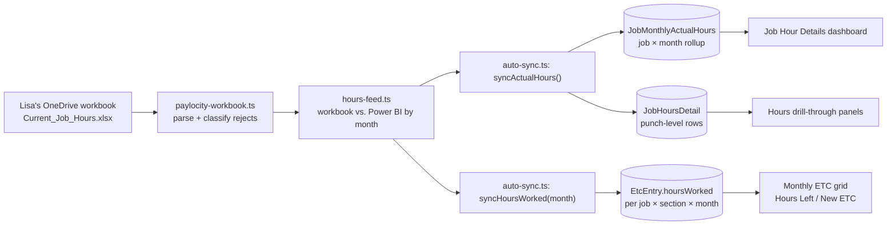
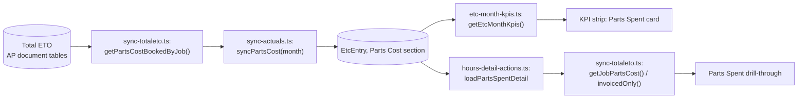
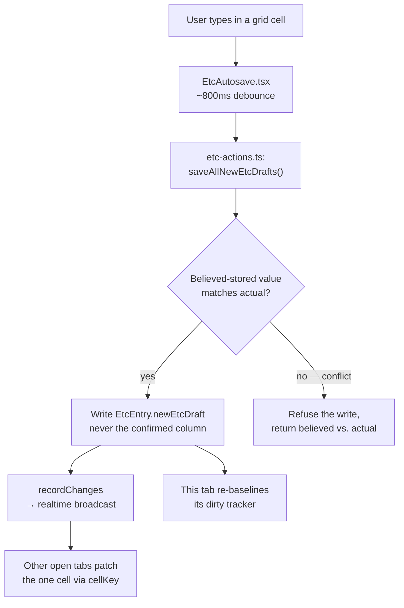

# Data Flow

How data actually moves from an external source to a rendered screen (and, where relevant,
back out to a database), for the flows that matter most in this app. For the formulas applied
along the way, see [ETC-BUSINESS-LOGIC.md](ETC-BUSINESS-LOGIC.md); for what triggers each sync
step, see [REFRESH-PIPELINE.md](REFRESH-PIPELINE.md).

## Hours



Rejected rows (bad date, unmapped section, unknown job) are collected as typed `RejectedPunch`
records rather than dropped — they surface as Undefined Hours (see
[ETC-BUSINESS-LOGIC.md](ETC-BUSINESS-LOGIC.md#10-hours-off-the-grid--undefined-hours)).

## Parts cost



A **separate** lifetime measure — `getPartsCostSpentByJob` via `syncPartsCostActual()` — feeds
only the Projects grid's "Parts Cost Actual" column and is not part of this monthly flow. Don't
conflate the two when tracing a discrepancy.

## Monthly ETC cell edit



Only a **Submit** turns a draft into the confirmed `newEtc` — see §"Exports / submission" below
and [ETC-BUSINESS-LOGIC.md §9](ETC-BUSINESS-LOGIC.md#9-submission-readiness). There is no
`revalidatePath` on the save path; the UI update is optimistic on the editing tab and
event-driven on every other tab. See [REALTIME-SYNC.md](REALTIME-SYNC.md) for the conflict
model in detail.

## KPI / drill-through data

The KPI strip and its drill-throughs are **not one shared computation** in general — they run
separate queries against the same underlying `EtcEntry` rows and reconcile by using the same
formulas, not by sharing a result:

```
Server render (etc/page.tsx)
  ├─ etc-month-kpis.ts: getEtcMonthKpis(month, visibleJobs)   — synced fields (prior, worked, hoursLeft, parts.spent)
  └─ etc-issues.ts: buildEtcIssues(...)                        — off-grid jobs + undefined-hours counts

Client (EtcMonthKpiCards.tsx)
  reconcileEtcKpis(serverKpis, rollupLiveTotals(useEtcLiveTotals()))
      overrides ONLY the editable fields (newEtc, diff) from the live client-side cell store
  buildKpiBlocks(...)   — pure presentation, computes no KPI itself

On click → requestKpiDrill(scope)
  → a separate fetch per lane: loadUnattributedDetail / loadEtcMonthHoursDetail /
    loadPartsSpentDetail / loadJobPartsLines
```

The one place the KPI and its drill are **structurally** the same data, not just reconciled
rules: Undefined Hours. `recordUndefinedHours()` writes the KPI total and the drill's
punch-level rows in one pass, one transaction — see
[ETC-BUSINESS-LOGIC.md §10](ETC-BUSINESS-LOGIC.md#10-hours-off-the-grid--undefined-hours).

## Exports / submission

**Export** (`ExportMenu.tsx` → `lib/export/etc-export.ts`): reuses the exact same
`newEtcSeedText`/`newEtcDiff`/`effectiveNewEtc` functions the grid renders with, so an exported
sheet can never disagree with what's on screen. Rendered to CSV or XLSX by
`lib/export/csv.ts`/`xlsx.ts` from a shared `SheetSpec`.

**Submit** (`SubmitReportAction.tsx` → `monthly-report-actions.ts`'s `submitMonthlyReport()`):

1. Idempotency check (has this `submissionId` already been processed).
2. Permission check (Standard Sheet unlocked).
3. Duplicate-submission check for the month.
4. Staleness check — the browser's data fingerprint must match the server's current one.
5. `validateMonthlyReport()` must pass (see [ETC-BUSINESS-LOGIC.md §9](ETC-BUSINESS-LOGIC.md#9-submission-readiness)).
6. One transaction: `submitEtcEntriesInTx()` freezes every entry, plus a full
   `StandardSheetSnapshot` per job.
7. Record the submission, cascade the now-frozen New ETC into any already-open later months,
   log the audit entry.

Nothing about steps 1–5 mutates data — a failed check leaves the month exactly as it was.
