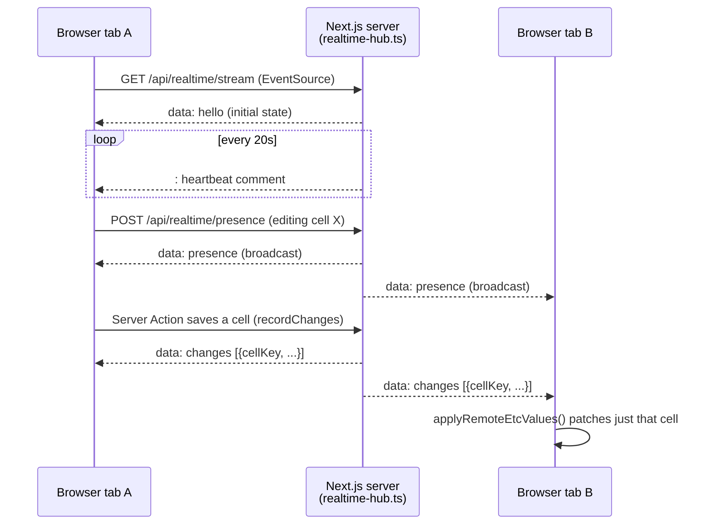

# Realtime Sync

How multiple people editing the Monthly ETC grid at once stay (mostly) in sync, without a
message queue or a second server process.

## The core constraint

Quoted directly from `src/lib/realtime-hub.ts`, because it governs everything else in this
document:

> This app is served by ONE non-cluster `next start` process (ecosystem.config.js declares a
> single app with no `instances`), on a LAN, for a handful of users... **This breaks the day
> anyone adds `instances: 2` or `exec_mode: 'cluster'` to ecosystem.config.js, or runs a second
> instance behind a load balancer.**

Presence and change state live in that one process's memory. There is no Redis, no pub/sub
broker, no database-backed queue. The hub logs a runtime warning if `NODE_APP_INSTANCE` is ever
non-zero, as a tripwire against exactly this.

## Transport and event flow

- **Transport**: Server-Sent Events, one connection per browser tab
  (`src/app/api/realtime/stream/route.ts` returns a `ReadableStream`; the client opens it via
  `new EventSource(...)` in `RealtimeProvider.tsx`). A 20-second comment-only heartbeat keeps
  the connection alive through idle proxies.
- **Event types**: `hello` (initial handshake on connect), `presence` (a full snapshot of who's
  editing which cell), and `changes` (an array of change events).
- **Subscribing**: `useRealtimeChanges()`, `useRealtimeStatus()`, and `useCellPresence()` in
  `RealtimeProvider.tsx`, backed by module-scope stores read via `useSyncExternalStore` — not
  React context, so a presence update doesn't force a re-render of the ~800 grid cells that
  don't care about it.

## Live cell updates

A change event carries a `cellKey` (and an `altCellKey`, since one cell has two valid
form-field names depending on context). A tab that receives a change addressed to a specific
cell patches just that cell via `applyRemoteEtcValues()` — no refetch. A change that can't be
addressed to a single cell falls back to a throttled full-route refresh instead of trying to
patch something it can't identify.

## Presence / edit indicators

Presence is a full-set broadcast, not a diff: every connected client's current
"editing cell X" state is sent as one snapshot whenever it changes. `tests/realtime-hub.test.ts`
is explicit about the invariant this exists to guarantee — a presence indicator must never
outlive actual editing, covering every way editing can end: explicit leave, a save, a cancel,
the underlying SSE connection dropping, and a TTL-based staleness fallback in case none of those
fire cleanly.

## Conflict handling

Grid saves use **optimistic concurrency**, not last-write-wins and not locking:

1. The client sends only the cells it actually touched, plus — for each — the value it
   *believes* is currently stored (`newEtcBase__<id>` in the posted form data).
2. The server (`saveAllNewEtcDrafts()` in `src/lib/etc-actions.ts`) compares that believed value
   against what's actually stored (`isStaleDraftWrite()`).
3. A mismatch is refused outright — never silently overwritten — and the response includes the
   believed value, the actual stored value, and what the client wanted to write, so the client
   can reload and retype rather than guess.

This is what makes it safe for two tabs to have the same cell open: whichever save lands first
wins normally, and the second save is rejected with enough information to recover rather than
clobbering the first.

## Reconnection

When an `EventSource` reconnects (`onopen`), the client immediately requests a full live
refresh — missed presence and change events from the disconnected period can't be replayed, so
the client re-syncs from scratch rather than trying to catch up incrementally.
`RealtimeProvider.tsx` backs off exponentially between reconnect attempts rather than hammering
the server.

Independently of the event stream, `src/app/api/realtime/version/route.ts` exposes a cheap
freshness check (the max `AuditLog` id) that any tab can poll to answer "has anything changed"
— a deliberate second signal, since not every write path publishes a realtime event yet.

## Cache / state patching

There is no client-side cache layer (no SWR/React Query). "State" that gets patched by realtime
events is:

- The **live cell store** (`etc-live-totals.ts`) — client-computed totals using the same
  `lib/etc.ts` functions the server uses, kept current by applying incoming cell changes
  directly rather than refetching.
- The **presence store** — replaced wholesale on each `presence` event.
- A **dirty-edit tracker** — re-baselined after this tab's own save succeeds, so a subsequent
  realtime update from another tab doesn't appear to conflict with this tab's own
  already-saved edit.

## Related reading

- [DATA-FLOW.md §Monthly ETC cell edit](DATA-FLOW.md#monthly-etc-cell-edit) — the save path
  this section's conflict handling protects.
- [TROUBLESHOOTING.md](TROUBLESHOOTING.md#realtime-disconnected) — what to check when presence
  or live updates stop working.
