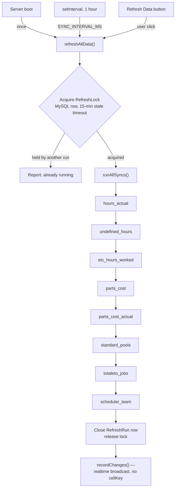

# Refresh Pipeline

How data gets from upstream systems into this app's own database — on a schedule, and on
demand. For what each source actually is, see [INTEGRATIONS.md](INTEGRATIONS.md); for what
happens once data lands in the database, see [DATA-FLOW.md](DATA-FLOW.md).

## One shared entry point

Every trigger — server startup, the hourly timer, and the dashboard's "Refresh Data" button —
calls the same function: `refreshAllData()` in `src/lib/refresh-service.ts`. There is no
separate "manual refresh" code path that could drift from the scheduled one.

## Source order

Fixed and sequential, defined once in `src/lib/auto-sync.ts`'s `SYNC_SOURCES`:

1. `hours_actual` — Paylocity hours import
2. `undefined_hours` — rejected-punch aggregation (depends on step 1's rejects)
3. `etc_hours_worked` — writes `EtcEntry.hoursWorked` for the open ETC month
4. `parts_cost` — Total ETO AP-document pull → `EtcEntry` Parts Cost section
5. `parts_cost_actual` — Total ETO lifetime parts snapshot → Projects grid column
6. `standard_pools` — Standard Fees pool computation
7. `totaleto_jobs` — mirrors Total ETO's project list into the `Job` table
8. `scheduler_team` — mirrors the Scheduler app's team roster

Each step runs fully before the next starts — there is no parallelism between sources (there is
concurrency *within* a couple of individual steps, like the Job Hour Details page's own
TotalETO calls, but that's unrelated to this pipeline's own sequencing).

## Failure handling

Each source is wrapped in its own try/catch (the `step()` helper in `auto-sync.ts`). One
source failing records a `"failed"` status **for that source only** and the pipeline continues
to the next one — a Total ETO outage doesn't prevent the Paylocity hours import from running,
and vice versa.

**There is no retry policy**, deliberately — the code comment states it plainly: *"the interval
IS the retry."* A failed source will simply be attempted again on the next hourly pass (or the
next manual click). This trades faster recovery for simplicity; a source that fails
consistently for reasons the hourly retry can't fix (an expired credential, say) will fail
consistently every hour until a human intervenes — see
[TROUBLESHOOTING.md](TROUBLESHOOTING.md).

## Cache invalidation / recalculation

There is no separate cache to invalidate — each sync step writes its result directly into the
app's own tables (`JobMonthlyActualHours`, `EtcEntry`, `Job`, etc.), and every page reads those
tables fresh on each request (Server Components, no data-layer cache). "Recalculation" is
simply the next read after the write — there's no derived/materialized table that needs an
explicit rebuild step.

## Broadcast / update flow

Three separate mechanisms tell a user a refresh happened, not one:

1. **The tab that clicked the button** gets the result synchronously as the return value of the
   `refreshApplicationData` Server Action, which also calls `revalidatePath` on the relevant
   pages.
2. **While a refresh is in flight**, any tab polls a dedicated route,
   `/api/refresh/status`, once a second — deliberately a route handler and not a second Server
   Action, since Next.js serializes Server Actions per client and a polling action would queue
   up behind the very refresh it's trying to check on.
3. **Every other connected tab** learns via the realtime broadcast: `refresh-service.ts` calls
   `recordChanges(...)` with no `cellKey` when a refresh completes, which every tab treats as
   "something changed, do a throttled full-page refetch" (see
   [REALTIME-SYNC.md](REALTIME-SYNC.md)) in addition to showing a toast/banner.

## Concurrency control

`RefreshLock` (a MySQL row, updated with a conditional `UPDATE`) ensures only one refresh runs
at a time across however many browser tabs might click the button simultaneously. The lock is
considered stale and reclaimable after 15 minutes, in case a previous run crashed without
releasing it.

## Freshness reporting

`recentRefreshRuns()` reads the last few `RefreshRun` rows for the dashboard's "last refreshed"
line; `currentRefresh()` reads the lock + in-progress run together to answer "is one running
right now, and on which step" for the status poller above. `PowerBiFreshness` separately tracks
per-source data-through dates for the freshness chips shown per source on the dashboard.
